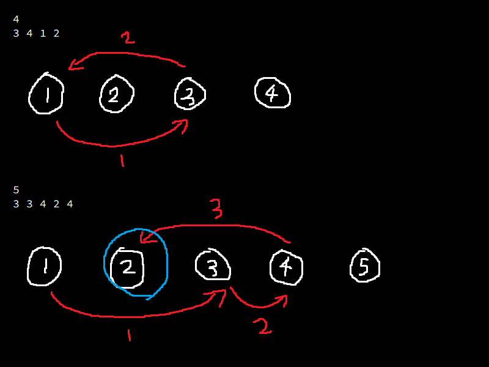

# [abc065_b (Trained?)](https://atcoder.jp/contests/abc065/tasks/abc065_b)

<details>
  <summary>알고리즘 분류</summary>
  
  *graph, implementation, simulation*
</details>

<br />

## 풀이 과정

각 버튼을 그래프의 노드로 본다.

불이 켜져있는 $i$번 버튼을 눌러서 $a_i$번 버튼의 불을 켜는 작업은 $i$번 노드에서 $a_i$번 노드로 향하는 화살표를 그리는 것과 같다고 생각할 수 있다. 따라서 해답이 존재하려면 1번 노드에서 시작해서 2번 노드에서 끝나고 사이클이 없는 방향 그래프가 존재해야 한다. 그래프에 사이클이 있는지 판단하기 위해 이미 누른 적이 있는 버튼을 한번 더 눌렀을 때는 해답이 없는 것으로 간주하고 `-1`을 출력하도록 하였다.

<br />



<br />

## 소스 코드

```c
#include <stdio.h>
#include <stdlib.h>
 
int main(void) {
    int n;

    scanf("%d", &n);

    int *buttons = malloc(n * sizeof *buttons);

    for (int i = 0; i < n; i++) scanf("%d", &buttons[i]);

    int *visited = calloc(n + 1, sizeof *visited);

    int result = 1, current = buttons[0];

    while (current != 2) {
        int next = buttons[current - 1];

        if (visited[next]) {
            result = -1;

            break;
        }

        visited[next] = 1;

        current = next, result++;
    }

    printf("%d\n", result);

    free(visited), free(buttons);

    return 0;
}
```