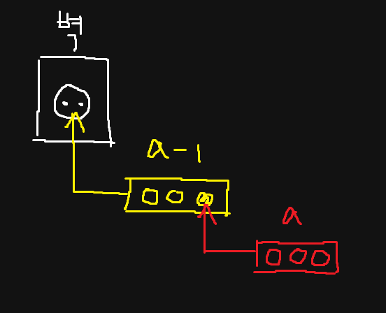

# [abc139_b](https://atcoder.jp/contests/abc139/tasks/abc139_b)

<details>
  <summary>알고리즘 분류</summary>
  
  *implementation*
</details>

<br />

## 풀이 과정

이 문제는 두 가지 경우로 나누어서 생각한다.

1. 콘센트가 한 개만 필요한 경우, 즉 `b == 1`인 경우에는 굳이 멀티탭을 살 필요가 없으므로 0을 출력한다.

2. 콘센트가 두 개 이상 필요한 경우에는 무조건 멀티탭을 사야 한다. 이때, 콘센트의 개수가 `a`개인 `a`구 멀티탭에서 실제로 사용할 수 있는 콘센트의 개수는 아래 그림을 통해 `a`개 또는 `a - 1`개임을 확인할 수 있다.

<br />



<br />

## 소스 코드

```c
#include <stdio.h>
#include <stdlib.h>

int main(void) {
    int a, b;

    scanf("%d %d", &a, &b);

    int socket_count = a, result = 1;

    while (socket_count < b)
        socket_count += (a - 1), result++;

    printf("%d\n", (b > 1) ? result : 0);

    return 0;
}
```